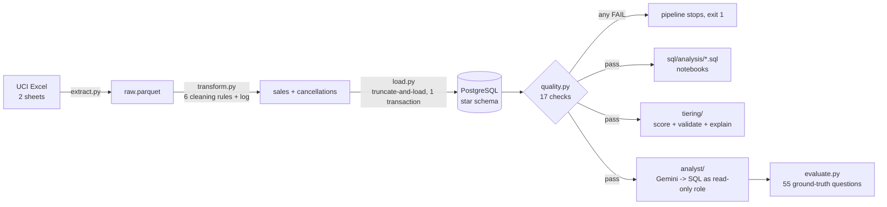
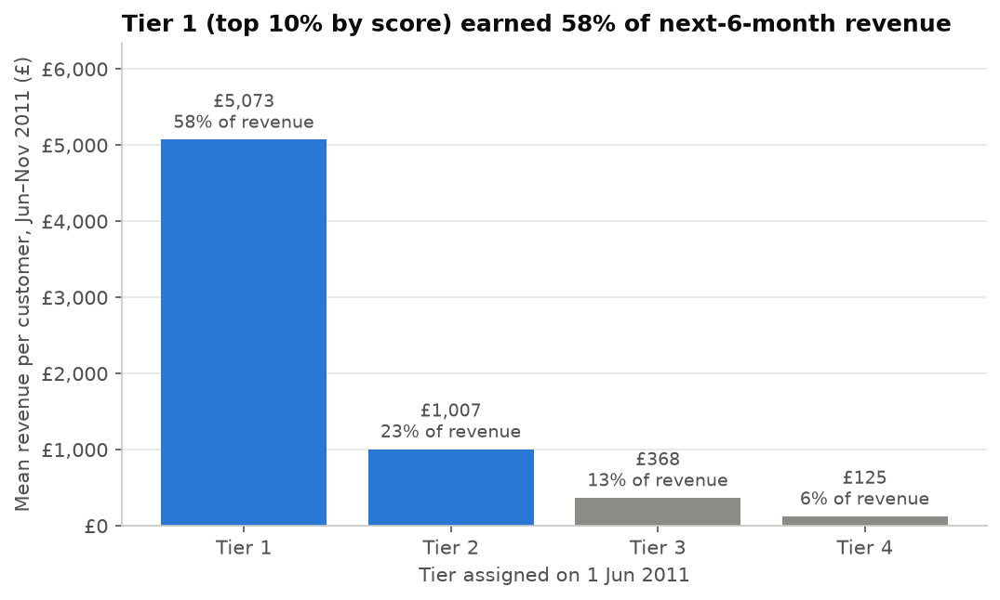
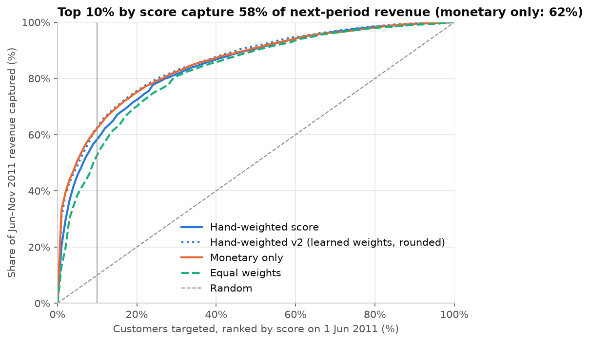

# Retail Sales Data Platform: Pipeline, Customer Tiering and an Evaluated AI Analyst

A tested, idempotent ETL pipeline into a PostgreSQL star schema; a multi-factor customer tiering model validated on future revenue; and a Gemini text-to-SQL analyst measured against a ground-truth question set, including how often it is confidently wrong.

Data: 1.07M transactions from a UK online wholesaler, Dec 2009 – Dec 2011. All figures are in GBP and come from [`RESULTS.md`](RESULTS.md), which is generated by code.

## Key findings

- **Pipeline:** 1,067,371 raw rows are cleaned to 776,579 sales lines and loaded into a 5-table star schema. All **17** quality checks run on every load, and **16 pass with 1 warning** (volume, below). Revenue reconciles between pandas and Postgres to the penny (£17,068,582.72). Two consecutive runs produce byte-identical tables (same content fingerprint).
- **Tiering works, but a simpler baseline beats it on the headline metric:** the 10% of customers ranked Tier 1 on 1 Jun 2011 earned **58.3%** of the next six months' revenue. Mean future revenue falls monotonically by tier (£5,073 → £1,007 → £368 → £125). A monetary-only ranking captured **62.3%**, though. Weights learned on an earlier period and rounded (v2) captured **62.6%**, only 0.3 points more than monetary-only.
- **Revenue is concentrated:** the top 10% of customers drive **63.9%** of all revenue, and the top 1% drive **32.1%**.
- **AI analyst:** on a frozen 55-question ground-truth set, pooled across three Gemini models, the **confidently-wrong rate fell from 3.4% to 1.6% to 0.2%** (17/495 → 8/495 → 1/440 answers) as a business glossary and then a self-check step were added. The v3 execution accuracy is 97.7–100% for every model, and every unanswerable question is refused.

## Architecture



Star schema: `fact_sales` and `fact_cancellations` (order-line grain) share the `dim_customer`, `dim_product` and `dim_date` dimensions. See [`sql/schema.sql`](sql/schema.sql).

## Charts






## How the pipeline guarantees correctness

`python -m pipeline.run` runs extract → transform → load → checks, and exits non-zero if any check fails.

- **Idempotent load.** One transaction truncates all five warehouse tables and bulk-loads them with `COPY`. Re-running gives the same tables, and a crash half-way rolls back to the last good load, so readers never see a half-empty warehouse. Surrogate keys come from the deterministic transform order. Each run writes an md5 fingerprint of every table's full content to `etl_run_log`, and two runs on the same input match exactly.
- **Independent reconciliation.** Postgres recomputes `revenue = quantity * price` itself as a generated `NUMERIC` column, so the revenue check compares two separate calculations rather than a copied column. A truncated price type, a dropped batch or a double `COPY` would all fail it.
- **Checks** (`pipeline/quality.py`):
  - row counts per table
  - revenue reconciled to the penny
  - no nulls in keys
  - positive quantity and price
  - unique keys
  - referential integrity
  - schema drift against a stored contract (`pipeline/contract.json`), for both the raw extract and the warehouse
  - monthly volume anomaly (more than 3 sd from the rolling 6-month median)
  - freshness: the newest loaded invoice equals the newest source invoice
- **Volume check: two parts.**
  - A **partial-period** test flags any month whose data covers under 50% of its calendar days. It catches December 2011 (9 of 31 days) and would catch a load that silently stopped mid-month. The Christmas shutdown (sales stop around 23 December) is not flagged.
  - A **row-count z-score** compares each full month with the rolling median of the previous 6 full months.
  - The first version had only the z-score and *missed* the partial month, because the Sep–Nov peaks inflate the rolling standard deviation. It still flags those seasonal peaks, since it has no year-over-year baseline, which is why the check is a WARN, not a FAIL.
- **Tests:** 54 pytest tests cover:
  - each cleaning rule, on hand-made tables
  - load idempotency, and quality checks failing on a silent row loss, against a real Postgres
  - the tiering score, tiers, the cutoff in the SQL features, and `explain`
  - SQL guardrails and result matching

  GitHub Actions runs them on every push against a `postgres:16` service.

## Tiering method and validation

Scored on **2011-06-01** using only earlier transactions, then judged on what each customer spent **2011-06-01 to 2011-11-30**. That time split is the leakage guard: no feature can see the outcome.

1. **8 features** are computed in SQL (`tiering/features.py`):
   - recency
   - frequency
   - monetary
   - tenure
   - average order value
   - product breadth
   - cancellation rate
   - regularity (std dev of days between orders)
2. Each feature becomes a **0–1 percentile rank**. Recency, cancellation rate and irregularity are inverted, so 1 is always best. Because every input is a percentile, a weight means the same thing whatever the units.
3. **Score** = weighted sum with documented v1 weights: recency 0.25, frequency 0.25, monetary 0.30, breadth 0.10, cancellation 0.10. Tenure, AOV and regularity carry 0 in v1.
4. **Tiers** by score rank: Tier 1 = top 10%, Tier 2 = next 20%, Tier 3 = next 30%, Tier 4 = bottom 40%.

| Method (4,908 customers) | Spearman vs future revenue | Top 10% captures |
|---|---|---|
| **Hand-weighted v1** | **0.607** (best) | 58.3% |
| Monetary only | 0.569 | 62.3% |
| Equal weights | 0.580 | 52.8% |
| Logistic regression (trained on Dec 2010 → May 2011) | 0.596 | 62.6% |
| Gradient boosting (same training) | 0.573 | 61.3% |
| v2: learned weights rounded to 0.05 | 0.600 | 62.6% |

**What this says.** v1 ranks the *whole* customer base best (highest Spearman), because recency and frequency separate "will buy again" from "gone". But the top of the list is about who spends big, and a pure monetary ranking wins there.

The learned model is trained one period earlier, so its test is out of sample. It moves weight *toward* monetary (0.42) and average order value (0.19), and *away from* breadth and cancellations (about 0).

**What I would ship.** v2 is still a five-number weighted sum anyone can audit, it matches the learned model's top-10% capture, and it keeps most of v1's ranking quality. Its gain over monetary-only is small, though (+0.3 points), and that is worth saying out loud.

**Weight sensitivity.** Changing any single weight by ±50% moves at most **8.3%** of customers to a different tier. Top-10% capture stays within 57.5–59.4%, so the tiers are not an artefact of one arbitrary number.

**Explainability: `explain(customer_id)`**. Two worked examples (`python -c "from tiering.score import explain; print(explain(12346)['text'])"`):

```
Customer 15716: Tier 1, score 85.2/100 (rank 245 of 4,908)
  Revenue to date (£)                    2,266.37  percentile  78.7  x weight 0.30  =  23.6 pts
  Days since last order                        10  percentile  93.4  x weight 0.25  =  23.4 pts
  Orders                                       10  percentile  88.3  x weight 0.25  =  22.1 pts
  Distinct products bought                    174  percentile  90.6  x weight 0.10  =   9.1 pts
  Share of orders cancelled                     0  percentile  70.9  x weight 0.10  =   7.1 pts
```
*For a sales manager:* "This customer ordered 10 days ago, orders often, buys a wide range and never cancels, so they are Tier 1 even though their total spend is only above-average." (In fact they spent just £216 in the next six months. A tier is a probability, not a promise.)

```
Customer 12346: Tier 3, score 60.1/100 (rank 1,679 of 4,908)
  Revenue to date (£)                   77,352.96  percentile  99.8  x weight 0.30  =  29.9 pts
  Orders                                        3  percentile  54.4  x weight 0.25  =  13.6 pts
  Days since last order                       134  percentile  51.9  x weight 0.25  =  13.0 pts
  Distinct products bought                     25  percentile  35.4  x weight 0.10  =   3.5 pts
  Share of orders cancelled                  0.62  percentile   0.9  x weight 0.10  =   0.1 pts
```
*For a sales manager:* "Their £77k is almost all one order that was then cancelled. They have bought only 3 times and not for 4 months, so they sit in Tier 3 despite the biggest single order in the data." They spent £0 in the next six months. This is the case where monetary-only ranking is fooled and the multi-factor score is not.

## AI analyst (`analyst/`)

`python -m analyst.agent "question"` asks Gemini for **one read-only SQL query**, runs it in Postgres and answers in plain English. Optionally, `uvicorn analyst.api:app` serves `POST /ask`.

**Guardrails**, in layers:
1. The model may **abstain**: "I can't answer that from this data."
2. `validate_sql()` accepts a single `SELECT`/`WITH` only. It rejects DDL/DML, `SELECT INTO`, multiple statements, `pg_sleep`, `set_config`, and similar.
3. The query runs as **`analyst_ro`**, a Postgres role with only `SELECT` on the warehouse, `default_transaction_read_only` and a **15 s statement timeout**. A test proves the role cannot write even if the first two layers were bypassed.
4. At most 200 rows are fetched.

On a SQL error the model gets **one retry**, with the error message fed back. API 429/5xx responses get exponential backoff with jitter, honouring the server's `retryDelay`. Every call is logged to `logs/analyst.jsonl` (question, SQL, latency, success), and answers are cached per model.

**Evaluation** (`analyst/evaluate.py`, `analyst/eval_set.yaml`):
- **Ground truth:** 55 questions (6 easy, 10 medium, 27 hard, 12 unanswerable), each answerable one with a hand-written reference SQL.
- **Grading compares result sets, not SQL text.** Rows are matched order-insensitively with numeric tolerance, and extra columns are allowed. Two different queries that return the same numbers are both right, and a plausible-looking query that returns the wrong numbers is wrong.
- **Confidently wrong** (the headline): the analyst answered (did not abstain, the SQL ran) and the answer was wrong, *or* it answered an unanswerable question. These are the dangerous cases: an authoritative-looking number that is false.

**How the eval set got to v2, and why that matters.** The first set (31 answerable + 8 unanswerable, each question spelling out its definitions) **saturated**: models scored 100%. A hand audit of the few "wrong" verdicts showed they were grader bugs, not model errors: a month returned as `2011-01` instead of a date, a share given as 0.796 instead of 79.6. I fixed the matcher, with unit tests, to accept equivalent month formats and, only for questions flagged `unit: percent`, fractions.

I then made the set harder **before** running the self-check mitigation, adding 15 items:
- net vs gross revenue
- questions that tempt a sales × cancellations join
- multi-step time comparisons
- ambiguous business terms ("active customer")
- 4 more unanswerable questions

That set is frozen as **eval set v2** (its SHA-256 is pinned in `tests/test_analyst.py`). v1, v2 and v3 were then re-run on exactly that file for every model, so the comparison is apples to apples.

**Mitigations.** Each targets a failure mode seen in the baseline, not a specific question:
- **v2, business glossary.** The company's metric definitions: revenue = gross sales, "net" only when asked; order = invoice; returns = cancellations. Plus a no-proxy rule: if a concept has no column, abstain.
- **v3, glossary + self-check.** After the SQL runs, the model sees the SQL and a result preview. It checks for fan-out joins, filtering before window functions, wrong units or periods, implausible values and proxy metrics, then confirms, fixes or abstains.

| Model (3 runs each) | v1 baseline | v2 + glossary | v3 + self-check |
|---|---|---|---|
| gemini-3.5-flash: confidently wrong | 2.4% (4/165) | 0.0% (0/165) | 0.0% (0/110)* |
| gemini-3.5-flash-lite: confidently wrong | 4.2% (7/165) | 3.0% (5/165) | 0.6% (1/165) |
| gemini-3.1-flash-lite: confidently wrong | 3.6% (6/165) | 1.8% (3/165) | 0.0% (0/165) |
| Execution accuracy (range over models) | 94.6–97.7% | 94.6–100% | 97.7–100% |
| Abstention accuracy (range) | 91.7–100% | 100% | 100% |
| Latency p50 / p95 (range over models, s) | 0.9–5.0 / 2.1–23.5 | 1.0–3.7 / 2.4–9.6 | 1.4–7.2 / 2.3–15.7 |

\*2 complete runs: the API key's prepaid credits ran out (HTTP 402) during the third. Full per-run numbers and every failing question are in [RESULTS.md](RESULTS.md).

**What went wrong, and what fixed it.** I hand-checked every "wrong" verdict against the reference.
- **Definition drift** (fixed by v2). gemini-3.5-flash computed "total revenue in 2010" net of cancellations in 3 of 3 runs: £7.74M instead of the official £8.22M.
- **Fabricated proxy** (fixed by v2). gemini-3.1-flash-lite answered "profit margin" with an invented formula (result 1.0) instead of abstaining.
- **Fan-out joins** (mostly fixed by v3). Joining sales to cancellations on customer or date multiplied rows: £31.4M "net revenue" for one customer (true top: £570K), *negative* £356M for 2011, and 6,851 "new customers" in a month (true: 221).
- **Filtering before `LAG`** (1 run left in v3). The first month of the window lost its previous month.

**Honest caveats.**
- The glossary *alone* made gemini-3.5-flash-lite slightly worse on some items. Its "add cancellations over the same period" wording seems to have nudged it into a date-join fan-out.
- The self-check rewrote SQL in only **2** of 165 runs for gemini-3.5-flash-lite (both correct fixes), so part of that model's v2 → v3 drop is run-to-run variance even at temperature 0. For gemini-3.1-flash-lite it fixed **12** runs, all correctly, and accounts for the whole drop.
- The self-check doubles the LLM calls per question.
- The statement timeout also turned two runaway `CROSS JOIN`s into visible errors instead of wrong numbers.

## Earlier analysis (kept from v1 of this project)

- **Cleaning** (`pipeline/transform.py`, `notebooks/01_clean.ipynb`). The steps run in a fixed order and each one is logged:
  - drop rows with no Customer ID
  - set cancellations aside (17.6% of invoices, 6.2% of revenue)
  - drop non-positive quantity or price
  - drop exact duplicates
  - drop non-product codes (postage, fees, adjustments, tests; the exact codes found are listed in RESULTS.md)

  In total **27.2%** of rows are removed, 22.8 points of it from missing Customer IDs.
- **SQL** (`sql/analysis/*.sql`, run from `notebooks/02_sql_analysis.ipynb`). These queries were first written for DuckDB and then ported to Postgres; every headline number came out identical, a free parity check between the engines. They cover:
  - monthly trends
  - top countries
  - top 3 products per country (`ROW_NUMBER() OVER (PARTITION BY country ...)`)
  - revenue concentration and a Lorenz curve
  - month-over-month retention (pooled **38.6%**)
- **RFM** (`notebooks/03_rfm.ipynb`). Quintile R/F/M scores and seven rule-based segments: Champions are **25.2%** of customers but **69.2%** of revenue, and **828 At-Risk** customers hold £1.59M of historical revenue.

## Limitations

- One retailer, one market: **83.7%** of revenue is from the UK. There is no cost or margin data, so everything is revenue, not profit.
- 22.8% of rows have no Customer ID and are excluded, so customer-level results describe identified (mostly B2B) buyers only.
- Tiering is validated on one cutoff and one 6-month window. **14.1%** of that window's revenue came from new customers who could not be scored at all. A rolling multi-cutoff backtest would give confidence intervals.
- The analyst eval is small: 55 questions × 3 runs, so a single answer moves the rate by about 0.6 points. The mitigations were designed after seeing baseline failures on the same set, so the v2/v3 gains may be optimistic on unseen questions; a held-out question set is the next step. Models were limited to the Gemini Flash family, first by free-tier quota and then by prepaid credits.
- Orchestration is out of scope. The next step is to run `pipeline.run` as an Airflow (or Dagster) DAG: extract, transform, load and quality as separate tasks, with the quality task gating downstream jobs. To migrate without silent failures: run the old and new pipelines in parallel, compare `etl_run_log` fingerprints and the reconciliation checks, and cut over once they match.

## How to run

```bash
pip install -r requirements.txt
# Online Retail II, UCI Machine Learning Repository, CC BY 4.0
curl -L -o data/online_retail_ii.zip "https://archive.ics.uci.edu/static/public/502/online+retail+ii.zip"
unzip data/online_retail_ii.zip -d data/

python -m pipeline.run          # extract -> clean -> load PostgreSQL (embedded pgserver) -> 17 checks
pytest                          # 54 tests; uses the same embedded Postgres (or DATABASE_URL)
python -m tiering.validate      # tiers, baselines, learned weights, sensitivity, charts

export GEMINI_API_KEY=...       # never committed; .env is gitignored
python -m analyst.agent "Which 5 countries had the most revenue in 2011?"
python -m analyst.evaluate --prompt v1 --runs 3
python -m analyst.evaluate --prompt v2 --runs 3
python -m analyst.evaluate --compare v1 v2
uvicorn analyst.api:app         # optional: POST /ask

jupyter nbconvert --to notebook --execute --inplace notebooks/0*.ipynb
python src/make_results.py      # metrics/*.json -> RESULTS.md
```

PostgreSQL comes from [`pgserver`](https://pypi.org/project/pgserver/) (embedded Postgres 16, no Docker); set `DATABASE_URL` to use any other server.

**Data:** Online Retail II, UCI Machine Learning Repository, CC BY 4.0.
