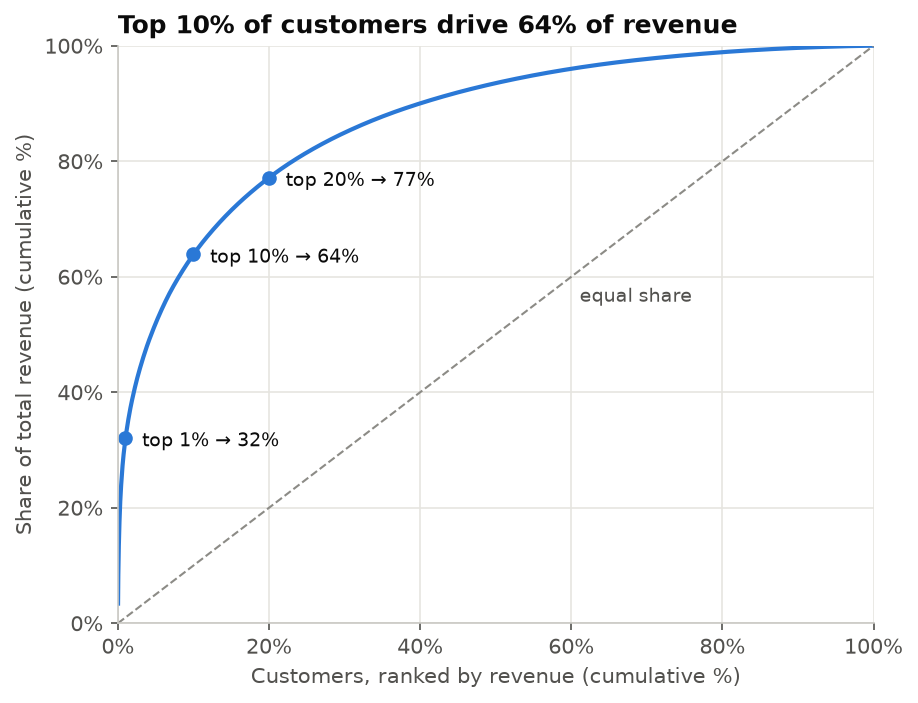
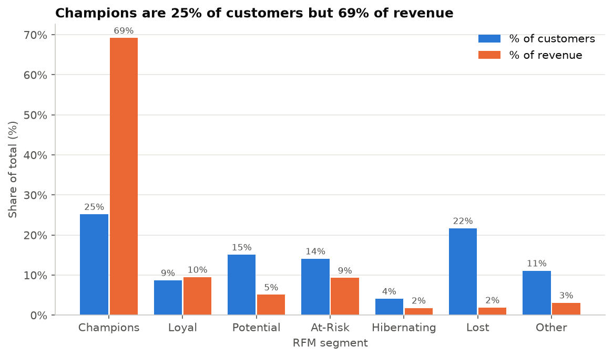
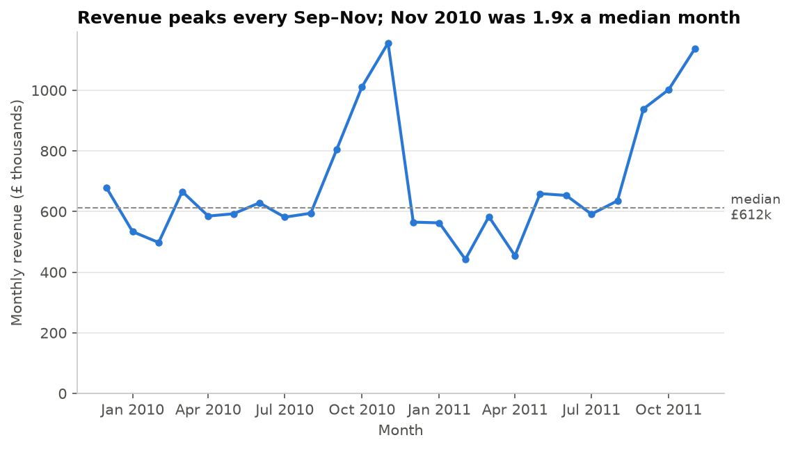

# Retail Customer Analytics: Churn and Revenue at Risk

**Business question:** Which customers are about to stop buying, how much revenue is at risk, and who should the sales team target first?

Data: 1.07M transactions from a UK online wholesaler (UCI Online Retail II, Dec 2009 – Dec 2011). All figures are in GBP and come from [`RESULTS.md`](RESULTS.md), which is generated by code.

## Key findings

- **Revenue is highly concentrated.** The top 10% of customers (586 of 5,852) drive **63.9%** of revenue, and the top 1% alone drive **32.1%**.
- **Champions carry the business.** The RFM "Champions" segment is **25.2%** of customers but **69.2%** of revenue.
- **£1.59M sits with customers who have gone quiet.** **828 At-Risk customers** (14.1%) used to order regularly (5.0 orders on average) but last bought **368 days** ago on average. They account for **9.3%** of historical revenue.
- **Demand is seasonal, driven by order volume.** Revenue peaks every Sep–Nov (Nov 2010 was **1.89x** a median month). The median order value stays within £260–£321 all year, so the peak comes from more orders, not bigger ones.

## Recommendations

1. **Run a win-back campaign for the 828 At-Risk customers** (£1.59M of historical revenue). Start with the highest spenders and measure it against a random holdout group.
2. **Put the top 1% (59 customers, 32.1% of revenue) under key-account management.** With revenue this concentrated, a handful of departures moves the whole top line, so these accounts need a named owner, not a mass campaign.
3. **Convert the 885 "Potential" customers before the Sep–Nov peak.** They bought recently but only 2.3 times on average, and autumn is when revenue runs up to 1.9x a median month.

## Charts







## Method

- **Data.** Both sheets of the UCI workbook are concatenated into one table (`src/load_data.py`).
- **Cleaning** (`src/clean.py`, `notebooks/01_clean.ipynb`). The steps run in a fixed order and each one is logged: drop rows with no Customer ID, set cancellations aside (17.6% of invoices, 6.2% of revenue; kept for a return-rate feature), drop non-positive quantity or price, drop exact duplicates, and drop non-product codes such as postage and fees. In total **27.2%** of rows are removed, 22.8 points of it from missing Customer IDs.
- **SQL** (`notebooks/02_sql_analysis.ipynb`). All aggregation is plain SQL in DuckDB: monthly trends, top countries, top 3 products per country (`ROW_NUMBER() OVER (PARTITION BY ...)`), revenue concentration and a Lorenz curve (window functions), and month-over-month retention (a self-join on customer-month, pooled rate **38.6%**).
- **RFM** (`notebooks/03_rfm.ipynb`). R, F and M are split into quintile scores from 1 to 5; frequency is ranked first to break ties. The seven segments come from explicit, ordered rules documented in the notebook. The R, F and M values for two random customers are recomputed independently and asserted equal.
- **Churn model.** *In progress.* A 90-day churn classifier with time-based validation is the next phase.

## Limitations

- One retailer, one market: **83.7%** of revenue is from the UK, so the results may not generalise.
- The data is from 2009–2011 and has no marketing, margin or cost data. "Revenue at risk" is revenue, not profit, and campaign ROI can't be estimated.
- 22.8% of rows have no Customer ID and are excluded, so customer-level figures describe identified (mostly B2B) buyers only.
- RFM segments use fixed quintile cut-offs. They describe past behaviour and don't predict it.

## How to run

```bash
pip install -r requirements.txt
# Download the dataset into data/ (the .xlsx inside the zip)
curl -L -o data/online_retail_ii.zip "https://archive.ics.uci.edu/static/public/502/online+retail+ii.zip"
unzip data/online_retail_ii.zip -d data/

python src/load_data.py                      # both Excel sheets -> data/raw.parquet (~2 min)
jupyter nbconvert --to notebook --execute --inplace notebooks/0*.ipynb
python src/make_results.py                   # metrics/*.json -> RESULTS.md
```
